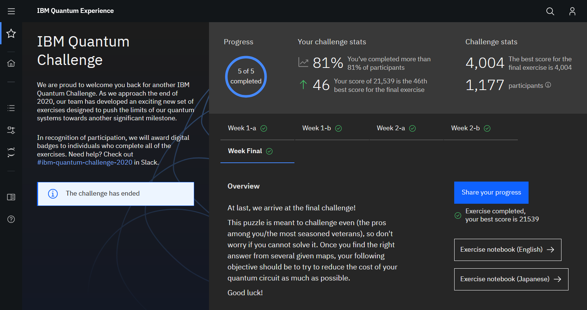
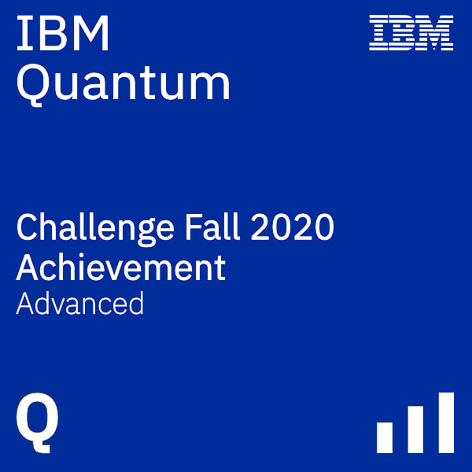

# IBM Quantum Challenge - Fall 2020  
  
These are the solutions I submitted for the [IBM Quantum Challenge - Fall 2020](https://quantum-computing.ibm.com/challenges)  
The original challenge repository is at [/qiskit-community/IBMQuantumChallenge2020](https://github.com/qiskit-community/IBMQuantumChallenge2020)  
  
## Challenge Details  
__Site:__ [IBM Quantum Experience](https://quantum-computing.ibm.com/challenges)  
__Date:__ November 2020  
  
## Certificate  
Here's a screenshot of my challenge portal dashboard.  
I got the 46th best score in the final challenge.  
[]  
  
And here's my advanced badge, for completing all the exercises.  
  
  
## Description  
The solutions are coded in `exXX_en.ipynb` in the `exercises` folder. Each also has `.html` copies for easier reference.  
The `.ipynb` are all self-contained, with explanations, problem statements and the exercise portion at the end.  
There are also completed mini-puzzles in `quizzes`, and the hints you get after completing them in `hints`.  
  
## Topics  
[`ex1a`](exercises/week-1) - Full Adder  
[`ex1b`](exercises/week-1) - Grover's Algorithm | Basics  
[`ex2a`](exercises/week-2) - Grover's Algorithm | Implementation  
[`ex2b`](exercises/week-2) - Grover's Algorithm | QRAM & Larger Search Spaces  
[`final`](exercises/week-3) - Grover's Algorithm | Choosing Oracles  